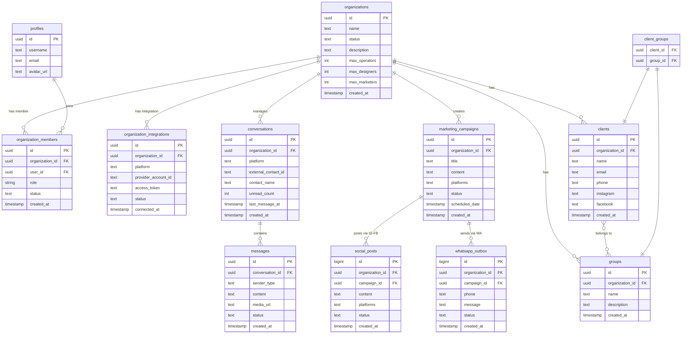

# ERD — Marketing Campaign Tools (Core Tables)

Diagram ini mencakup 12 tabel inti yang merepresentasikan alur bisnis utama.
Tabel pendukung (contacts, projects, email_events, link_clicks, messenger_outbox) tidak ditampilkan.



## Keterangan Relasi

| Entitas | Relasi | Entitas |
|---|---|---|
| organizations | 1 : N | organization_members |
| profiles | 1 : N | organization_members |
| organizations | 1 : N | organization_integrations |
| organizations | 1 : N | clients |
| organizations | 1 : N | groups |
| clients | M : N | groups *(via client_groups)* |
| organizations | 1 : N | marketing_campaigns |
| marketing_campaigns | 1 : N | whatsapp_outbox |
| marketing_campaigns | 1 : N | social_posts |
| organizations | 1 : N | conversations |
| conversations | 1 : N | messages |

## Enum

`app_role` = `admin` | `operator` | `designer` | `marketer`

## Catatan

- Semua FK menggunakan `ON DELETE CASCADE`
- Semua tabel memiliki RLS (Row Level Security) aktif
- `profiles.id` ↔ `auth.users.id` (Supabase Auth — di luar diagram)
- `organization_members` adalah tabel pivot yang juga menyimpan **role** user dalam org
- `client_groups` adalah tabel pivot murni (tidak ada kolom tambahan)
- `conversations` memiliki unique constraint pada `(organization_id, platform, external_contact_id)` — mencegah duplikasi thread per pelanggan per platform
```
